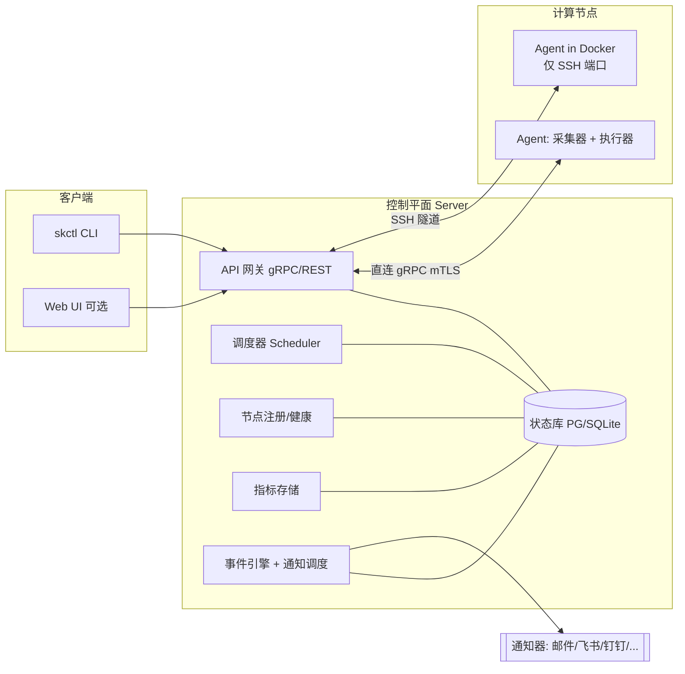

# Skipper

> 工作代号 **Skipper**（占位名，可随时替换）。一套面向 GPU/NPU 服务器集群的
> **资源监控 + 任务调度 + 事件通知** 一体化系统。

Skipper 的目标是用一个轻量的控制平面，统一管理一批异构服务器（物理机 / 虚拟机 /
仅暴露 SSH 端口的 Docker 容器），提供类似 Slurm 的任务排队与调度能力，并在硬盘写满、
GPU/NPU 长时间空置、任务结束等事件发生时，通过可插拔的通知器提醒相关用户。

## 核心特性

| 能力 | 说明 |
| --- | --- |
| 资源监控 | CPU / 内存 / 磁盘 / 网络 + GPU(NVIDIA) / NPU(昇腾等) 统一采集 |
| 任务调度 | 类 Slurm 的队列(Partition)、优先级、资源请求、作业生命周期、Backfill |
| 异构接入 | 直连 gRPC / **SSH 隧道**（适配「仅开放 SSH 端口」的 Docker） |
| 事件通知 | 事件引擎 + 规则路由 + 可插拔通知器（邮件 / 飞书 / 钉钉 / 企业微信 / Webhook…） |
| 部署 | 单二进制、容器化、SQLite(小规模) 或 PostgreSQL(生产) |

## 系统组成



- **控制平面（Server）**：单二进制，承载 API、调度器、节点注册、指标存储、事件/通知引擎与持久化。
- **节点代理（Agent）**：每个节点（含 Docker 容器）部署一个，负责资源采集、任务执行、状态上报。
- **客户端**：`skctl` 命令行（对标 `sbatch/squeue/sinfo/scancel`），可选 Web 控制台。
- **通知器（Notifier）**：可插拔的通知通道，由事件引擎按规则触发。

## 仓库结构（规划）

```
.
├── cmd/
│   ├── skipper-server/      # 控制平面入口
│   ├── skipper-agent/       # 节点代理入口
│   └── skctl/               # 命令行客户端
├── internal/
│   ├── server/              # API、节点注册、作业管理
│   ├── scheduler/           # 调度策略与作业生命周期
│   ├── agent/               # 采集、执行、上报
│   ├── collector/           # 资源采集器（cpu/mem/disk/gpu/npu）
│   ├── transport/           # 通信抽象（grpc / ssh 隧道 / 反向隧道）
│   ├── notify/              # 事件引擎 + 通知器插件
│   ├── store/               # 持久化与数据模型
│   └── proto/               # gRPC/protobuf 定义（生成代码）
├── api/                     # .proto 源文件、OpenAPI
├── deploy/                  # docker-compose、镜像、systemd、示例配置
├── docs/                    # 设计文档（见下）
└── web/                     # Web 控制台（可选，后期）
```

## 设计文档

| 文档 | 内容 |
| --- | --- |
| [docs/ARCHITECTURE.md](docs/ARCHITECTURE.md) | 总体架构、组件职责、数据流、监控、安全、部署拓扑 |
| [docs/SCHEDULER.md](docs/SCHEDULER.md) | 调度模型、作业生命周期、调度策略、资源隔离与下发 |
| [docs/TRANSPORT.md](docs/TRANSPORT.md) | 控制平面↔Agent 通信，SSH 隧道方案，Agent 引导 |
| [docs/NOTIFICATIONS.md](docs/NOTIFICATIONS.md) | 事件模型、规则路由、通知器插件、三类必备事件 |
| [docs/DATA-MODEL.md](docs/DATA-MODEL.md) | 数据实体、表结构草案、API 接口、CLI 映射 |
| [docs/ROADMAP.md](docs/ROADMAP.md) | 分阶段里程碑（M0–M5） |

## 技术选型（已确认）

- **语言：Go** ✅。单静态二进制易于塞进 Docker；`x/crypto/ssh`（SSH 隧道）、gRPC、
  `gopsutil`（CPU/内存/磁盘）、`go-nvml`（GPU）生态成熟；并发模型契合调度器与多节点通信。
- **存储：SQLite 为主** ✅（面向实验室个位数节点的单机 server）；存储层接口化，
  规模增长时可平滑切换 **PostgreSQL**，HA 留作按需后期。
- **加速卡：NVIDIA GPU + 昇腾 NPU** ✅（先 NVIDIA 后昇腾，均为早期目标）。
- **交付：CLI 优先** ✅（主攻 `skctl`，Web 控制台作为可选增强）。
- **通信：gRPC**（控制面 RPC）+ **grpc-gateway**（REST）+ **protobuf**（接口契约）。
- **指标：内置轻量存储**，同时暴露 **Prometheus** 端点以对接现有 Grafana 生态。

> 决策记录见 [docs/ROADMAP.md](docs/ROADMAP.md)。

## 当前状态

🚧 设计阶段，核心选型已确认（Go / SQLite 单机 / NVIDIA+昇腾 / CLI 优先）。
本仓库目前只包含设计文档。下一步进入 **M0 骨架**搭建，详见
[docs/ROADMAP.md](docs/ROADMAP.md)。
