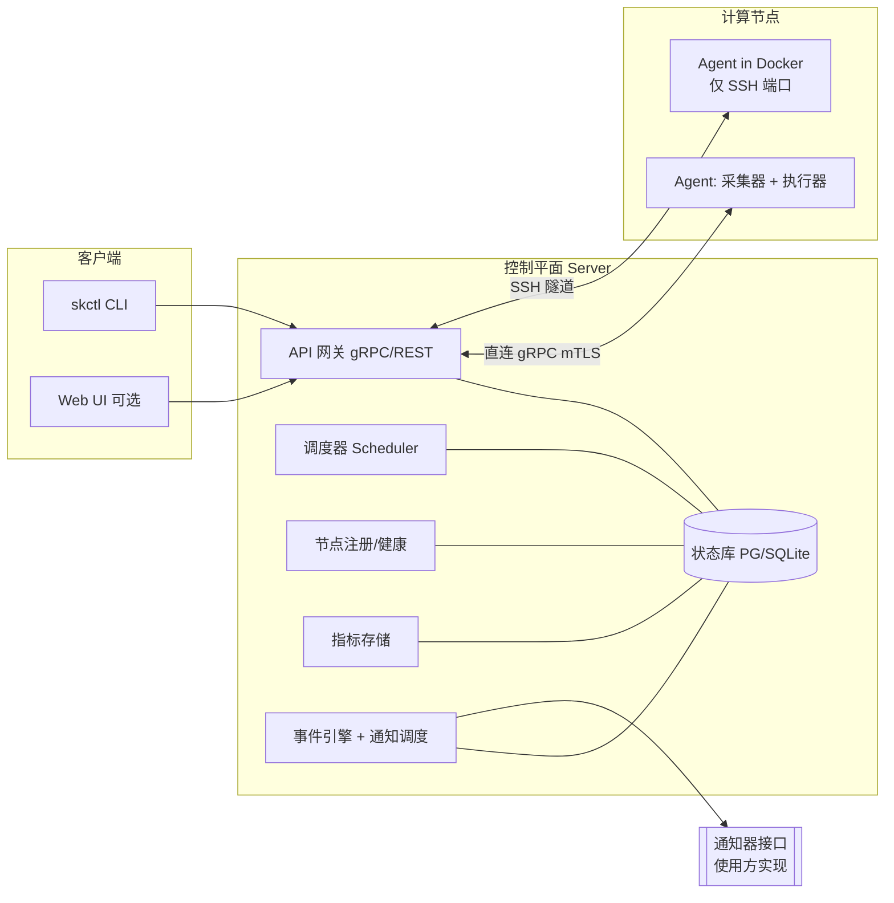

# Skipper

> 工作代号 **Skipper**（占位名，可随时替换）。一套面向 GPU/NPU 服务器集群的
> **资源监控 + 任务调度 + 事件通知** 一体化系统。

Skipper 的目标是用一个轻量的控制平面，统一管理一批异构服务器（物理机 / 虚拟机 /
仅暴露 SSH 端口的 Docker 容器），提供类似 Slurm 的任务排队与调度能力，并在硬盘写满、
GPU/NPU 长时间空置、任务结束等事件发生时，通过可插拔的通知器提醒相关用户。

## 核心特性

| 能力 | 说明 |
| --- | --- |
| 资源监控 | CPU / 内存 / 磁盘 / 网络 + GPU(NVIDIA) / NPU(昇腾等) 统一采集 |
| 任务调度 | 类 Slurm 的队列(Partition)、优先级、资源请求、作业生命周期、Backfill |
| 异构接入 | 直连 gRPC / **SSH 隧道**（适配「仅开放 SSH 端口」的 Docker） |
| 事件通知 | 事件引擎 + 规则路由 + 可插拔通知器**接口**（具体渠道由使用方实现，框架不内置） |
| 部署 | 单二进制、容器化、SQLite(小规模) 或 PostgreSQL(生产) |

## 系统组成



- **控制平面（Server）**：单二进制，承载 API、调度器、节点注册、指标存储、事件/通知引擎与持久化。
- **节点代理（Agent）**：每个节点（含 Docker 容器）部署一个，负责资源采集、任务执行、状态上报。
- **客户端**：`skctl` 命令行（对标 `sbatch/squeue/sinfo/scancel`），可选 Web 控制台。
- **通知器（Notifier）**：可插拔的通知通道，由事件引擎按规则触发。

## 仓库结构

`✅` 已实现（M0–M4）；其余为后续里程碑规划。

```
.
├── cmd/
│   ├── skipper-server/      # ✅ 控制平面入口
│   ├── skipper-agent/       # ✅ 节点代理入口
│   └── skctl/               # ✅ 命令行客户端
├── internal/
│   ├── config/              # ✅ 配置加载（YAML + 环境变量）
│   ├── log/                 # ✅ 结构化日志
│   ├── version/             # ✅ 版本信息
│   ├── server/              # ✅ gRPC 服务、节点注册、失联巡检 + 失联诊断
│   ├── agent/               # ✅ 资源采集、注册、心跳
│   ├── store/               # ✅ 持久化接口 + SQLite 实现
│   ├── collector/           # ✅ CPU/内存/磁盘 + GPU(nvidia)/NPU(ascend) 采集
│   ├── metrics/             # ✅ 近线指标存储（最新快照）
│   ├── scheduler/           # ✅ FIFO+优先级调度（纯函数 Plan + 调度循环）
│   ├── transport/           # ✅ SSH 反向隧道 + agent 自举(SCP 分发/拉起) + 失联诊断
│   ├── notify/              # ✅ 事件引擎 + 检测器 + 可插拔通知器接口
│   ├── event/               # ✅ 事件/通知数据模型
│   └── webui/               # ✅ Web 控制台（内嵌 SPA + JSON API 静态资源）
├── api/proto/               # ✅ .proto 接口契约
├── gen/                     # ✅ 生成的 gRPC 代码（已提交）
├── deploy/                  # ✅ 示例配置、Dockerfile、docker-compose
└── docs/                    # ✅ 设计文档（见下）
```

## 设计文档

| 文档 | 内容 |
| --- | --- |
| [docs/ARCHITECTURE.md](docs/ARCHITECTURE.md) | 总体架构、组件职责、数据流、监控、安全、部署拓扑 |
| [docs/SCHEDULER.md](docs/SCHEDULER.md) | 调度模型、作业生命周期、调度策略、资源隔离与下发 |
| [docs/TRANSPORT.md](docs/TRANSPORT.md) | 控制平面↔Agent 通信，SSH 隧道方案，Agent 引导 |
| [docs/NOTIFICATIONS.md](docs/NOTIFICATIONS.md) | 事件模型、规则路由、通知器插件、三类必备事件 |
| [docs/DATA-MODEL.md](docs/DATA-MODEL.md) | 数据实体、表结构草案、API 接口、CLI 映射 |
| [docs/ROADMAP.md](docs/ROADMAP.md) | 分阶段里程碑（M0–M5） |

## 技术选型（已确认）

- **语言：Go** ✅。单静态二进制易于塞进 Docker；`x/crypto/ssh`（SSH 隧道）、gRPC、
  `gopsutil`（CPU/内存/磁盘）、`go-nvml`（GPU）生态成熟；并发模型契合调度器与多节点通信。
- **存储：SQLite 为主** ✅（面向实验室个位数节点的单机 server）；存储层接口化，
  规模增长时可平滑切换 **PostgreSQL**，HA 留作按需后期。
- **加速卡：NVIDIA GPU + 昇腾 NPU** ✅（先 NVIDIA 后昇腾，均为早期目标）。
- **交付：CLI 优先** ✅（主攻 `skctl`，Web 控制台作为可选增强）。
- **通信：gRPC**（控制面 RPC）+ **grpc-gateway**（REST）+ **protobuf**（接口契约）。
- **指标：内置轻量存储**，同时暴露 **Prometheus** 端点以对接现有 Grafana 生态。

> 决策记录见 [docs/ROADMAP.md](docs/ROADMAP.md)。

## 快速上手

> 预编译二进制（linux **amd64 / arm64**）见 [Releases](../../releases)，下载解压即用；
> 推送 `v*` 标签即由 GitHub Actions 自动构建发布。从源码构建需 Go 1.25+：

```bash
# 1) 编译三个二进制到 bin/
make build            # 或 go build -o bin/ ./cmd/...

# 2) 启动控制平面（默认监听 :7443，SQLite 落到 skipper.db）
./bin/skipper-server --config deploy/server.yaml

# 3) 另开终端，启动一个节点代理（直连注册 + 周期心跳）
./bin/skipper-agent --server 127.0.0.1:7443 --name node-1 --partition gpu

# 4) 再开终端：节点库存 / 实时负载 / 设备
./bin/skctl nodes      # NAME STATE PARTITION CPUS MEM GPU NPU HEARTBEAT VERSION
./bin/skctl top        # 实时 CPU%/内存/负载
./bin/skctl gpu        # 各节点 GPU 实时指标（需 nvidia-smi）
./bin/skctl npu        # 各节点 NPU 实时指标（需 npu-smi）

# 5) 提交并管理作业
./bin/skctl submit --name train --partition gpu --gpus 1 --mem 32G --time 12h \
  -- 'python train.py --config big.yaml'
./bin/skctl queue                # 查看队列与状态
./bin/skctl logs -f <jobid>      # 跟踪作业日志
./bin/skctl cancel <jobid>       # 取消作业

# 6) 事件与通知（硬盘满 / 设备空置 / 任务结束 / 节点失联）
./bin/skctl events               # 最近事件
./bin/skctl notifications        # 通知投递记录

# 7) Prometheus 指标端点
curl -s localhost:9100/metrics | grep '^skipper_'

# 8) Web 控制台（默认 :8080，单二进制内嵌，无需单独部署前端）
#    浏览器打开 http://localhost:8080
#    概览 / 节点 / 设备 GPU-NPU / 作业队列 / 提交 / 事件 / 通知，
#    以及只读 JSON API（与 gRPC 共享同一份状态）：
curl -s localhost:8080/api/v1/nodes        # 节点 + 最新指标快照(含设备)
curl -s localhost:8080/api/v1/jobs         # 作业队列
curl -s localhost:8080/api/v1/events       # 事件流
```

> Web 控制台是纯静态 SPA（无构建步骤），通过 `//go:embed` 随 `skipper-server`
> 一起分发；配置 `web.http`（或环境变量 `SKIPPER_WEB_HTTP`）即可启用，留空则关闭。

修改 `.proto` 后用 `make tools`（首次）+ `make proto` 重新生成 gRPC 代码。
容器化：`docker compose -f deploy/docker-compose.yml up --build`。

## 当前状态

✅ **M0–M4 已完成——最初的 5 个诉求全部跑通**：
- **M0**：gRPC 骨架、配置/日志、SQLite 存储、注册/心跳、失联巡检、CI、容器化。
- **M1**（②监控）：CPU/内存/磁盘 + GPU(nvidia-smi)/NPU(npu-smi) 采集、Prometheus `/metrics`、`skctl top/gpu/npu`。
- **M2**（③调度）：作业模型与状态机、FIFO+优先级调度、单节点执行（设备隔离 `CUDA/ASCEND_VISIBLE_DEVICES`
  + walltime + 日志捕获 + 退出码）、`skctl submit/queue/cancel/logs`。
- **M3**（④SSH 通信）：SSH 反向隧道，纳管「仅开放 SSH 端口」的容器（**端口任意，不限 22**）；
  主机公钥校验、断线重连、保活。真实 sshd(2222) 端到端验证。
- **M3.1**（自举 + 诊断）：`provision` 经 SCP 自动分发并远程拉起 agent；节点失联持续一段时间后
  经 SSH 诊断根因（**SSH 连接中断 / agent 进程被杀 / 其他原因**），发 `node.diagnosed` 事件，
  可选 `auto_restart` 自动重拉。
- **M4**（⑤通知）：事件引擎 + 检测器 + 规则路由 + **可插拔通知器接口**，覆盖硬盘满 / 设备空置
  （区分已分配/空闲）/ 任务结束 / 节点失联；去重/冷却；`skctl events/notifications`。

✅ **M5.1 调度增强**：EASY backfill 回填（防饿死 + 填空隙）、`gpu_type` 真匹配、优先级老化。

✅ **Web 控制台**：单二进制内嵌的轻量 SPA + 只读 JSON API（`/api/v1`）——概览大盘、
节点 / 设备（GPU/NPU，快速找空卡、抓「占着不用」）、作业队列与详情（生命周期 + 实时日志）、
表单化提交、事件流与通知记录；列表四态（加载 / 空 / 错误 / 正常）、自动刷新、节点/设备/事件抽屉。

🚧 后续 **M5**（公平份额、抢占、RBAC、NPU 实机、cgroup 硬限额、登录鉴权 / HA），详见
[docs/ROADMAP.md](docs/ROADMAP.md)。
