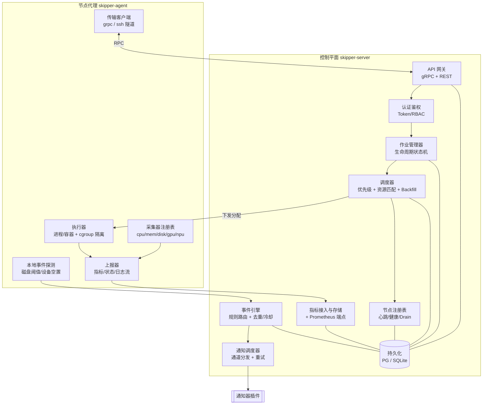
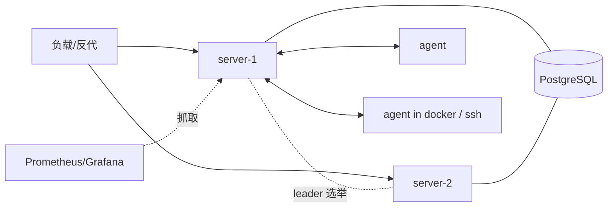

# 总体架构

本文档描述 Skipper 的整体架构、组件职责、关键数据流，以及监控、安全与部署拓扑。
调度、通信、通知三个子系统各有专门文档，本文只给出概览并交叉引用。

## 1. 设计目标与约束

| 目标 | 说明 |
| --- | --- |
| 异构服务器统一纳管 | 物理机、虚拟机、容器混合；CPU/内存/磁盘/GPU/NPU |
| 类 Slurm 调度 | 队列、优先级、资源请求、作业生命周期、可扩展策略 |
| 适配「仅 SSH」环境 | 部分 Docker 仅放开 22 端口，需经 SSH 通信，详见 TRANSPORT |
| 事件驱动通知 | 硬盘满、设备空置、任务结束等事件 → 可插拔通知器 |
| 轻量可演进 | 单机可跑（SQLite + 单 Server），可平滑扩展到生产（PG + HA） |

**非目标（至少初期）**：替代 Kubernetes 做通用容器编排；做完整的多租户计费平台；
跨数据中心联邦调度。这些可在后期作为扩展。

## 2. 组件分层



### 2.1 控制平面（skipper-server）

单二进制，内部按模块组织，初期单实例，后期可做 HA（无状态 + PG + 调度器 leader 选举）。

- **API 网关**：gRPC 为主，经 grpc-gateway 暴露等价 REST/JSON；统一入口给 CLI / Web / Agent。
- **认证鉴权**：用户与 API Token；RBAC（普通用户 / 管理员）；Agent 用节点凭据。
- **作业管理器**：维护作业状态机（见 SCHEDULER），落库，驱动状态流转与事件。
- **调度器**：周期性调度循环，按优先级与资源约束把 PENDING 作业匹配到节点（见 SCHEDULER）。
- **节点注册表**：节点注册、心跳、健康判定、`DRAIN/RESUME`、资源清单维护。
- **指标接入与存储**：接收 Agent 上报，保存近线数据供调度/空置判断；暴露 Prometheus。
- **事件引擎 + 通知调度**：汇聚事件，按规则路由到接收人与通道，去重/冷却/重试（见 NOTIFICATIONS）。
- **持久化**：PostgreSQL（生产）/ SQLite（单机）。存储层接口化以便切换。

### 2.2 节点代理（skipper-agent）

每节点/每容器一个进程。**只监听本地回环**即可（配合 SSH 隧道），也可直连。

- **采集器注册表**：按插件接口加载 CPU/内存/磁盘/网络/GPU/NPU 采集器，按周期采样。
- **执行器**：拉起并监管作业（进程或嵌套容器），施加 cgroup v2 资源限制，设置
  `CUDA_VISIBLE_DEVICES` / `ASCEND_RT_VISIBLE_DEVICES`，捕获日志与退出码。
- **本地事件探测**：磁盘阈值、设备空置等可在本地即时探测，发事件给控制平面。
- **上报器**：批量上报指标、作业状态、日志流。
- **传输客户端**：封装与控制平面的连接（直连 gRPC 或 SSH 隧道，见 TRANSPORT）。

### 2.3 客户端

- **skctl**：命令行，覆盖 `submit/queue/info/cancel/logs/node` 等（CLI 映射见 DATA-MODEL）。
- **Web UI（可选，后期）**：集群总览、节点/设备热力、作业队列、事件与通知配置。

## 3. 关键数据流

### 3.1 监控数据流

```
采集器(周期采样) → Agent 上报器(批量) → Server 指标存储
        → ① 供调度器做资源可用性判断
        → ② 供空置/阈值规则判断 → 事件引擎
        → ③ 暴露 Prometheus 端点 / Web 展示
```

Agent 本地保留一个环形缓冲（断连容忍），重连后补传。采样周期默认 5–15s，可配置。

### 3.2 作业调度数据流

```
skctl submit → API → 作业入库(PENDING) → 调度循环
   → 资源匹配成功 → 写入 Allocation → 经传输层下发到目标 Agent
   → Agent 执行器拉起任务(RUNNING) → 上报状态/日志
   → 任务结束 → Agent 上报退出码 → 作业置 COMPLETED/FAILED
   → 触发「任务结束」事件 → 通知提交者
```

### 3.3 事件/通知数据流

```
事件源(Agent 探测 / Server 探测) → 事件引擎(规则匹配 + 去重/冷却)
   → 解析接收人 → 按用户通道偏好 → 通知调度器(分发 + 重试) → 通知器插件
```

详见 [NOTIFICATIONS.md](NOTIFICATIONS.md)。

## 4. 资源监控概览

采集器统一接口（伪代码）：

```go
// 一次采样返回该来源的若干指标点
type Collector interface {
    Name() string                       // "cpu" / "gpu.nvidia" / "npu.ascend"
    Collect(ctx context.Context) (Sample, error)
}

// 设备(GPU/NPU)统一抽象，便于调度与空置判断
type Device struct {
    Kind      string    // "gpu" | "npu"
    Vendor    string    // "nvidia" | "ascend" | "cambricon" ...
    Index     int
    UUID      string
    MemTotal  uint64
    MemUsed   uint64
    Util      float64   // 0–100
    Temp      float64
    Power     float64
    Procs     []DeviceProc
}
```

- **CPU/内存/磁盘/网络**：`gopsutil`。磁盘按挂载点统计使用率与 inode。
- **GPU(NVIDIA)**：优先 NVML（`go-nvml`），降级解析 `nvidia-smi --query-gpu=... --format=csv`。
- **NPU(昇腾)**：解析 `npu-smi info`（必要时 DCMI/DSMI）。接口化以便接入寒武纪 `cnmon` 等。
- 设备统一抽象成 `Device`，让调度（按卡分配）与空置检测（按利用率窗口）与厂商解耦。

> 设备「空置」判断有个关键区分：**已分配但闲置**（用户占着卡不用，浪费）与
> **空闲未分配**（集群可用资源）。二者通知对象不同，详见 NOTIFICATIONS。

## 5. 安全模型

- **用户认证**：用户名/密码或 OIDC（后期）；API Token 用于 CLI/脚本。
- **授权**：RBAC。普通用户只能管理自己的作业；管理员可管理节点、队列、规则、通知通道。
- **节点信任**：
  - 直连模式：Agent↔Server **mTLS**，双向证书校验。
  - SSH 隧道模式：复用 SSH 的密钥认证与主机指纹校验，隧道内再加轻量 Token（见 TRANSPORT）。
- **密钥管理**：SSH 私钥、SMTP/Webhook 凭据等通过配置或密钥后端注入，不入库明文（加密存储）。
- **作业隔离**：cgroup v2 限制 CPU/内存；设备可见性通过环境变量隔离；可选 nested 容器强隔离。

## 6. 部署拓扑

### 6.1 单机 / 小规模

```
[ skipper-server + SQLite ]  ←直连/隧道→  [ skipper-agent × N ]
```
Server 单进程，SQLite 单文件，适合实验室一台管理机 + 若干计算节点。

### 6.2 生产



- Server 无状态化，状态全部落 PG；调度器通过 leader 选举保证单写。
- 指标对接外部 Prometheus + Grafana。
- Agent 以单二进制或 sidecar 容器形式部署到各节点；仅 SSH 的容器走隧道（见 TRANSPORT）。

### 6.3 容器化交付

- `deploy/docker-compose.yml`：本地一键起 server + postgres + 若干示例 agent。
- 镜像：`skipper-server`、`skipper-agent` 多架构镜像（amd64/arm64，arm64 利于昇腾环境）。
- 配置：YAML（`server.yaml` / `agent.yaml`），支持环境变量覆盖。

## 7. 可观测性

- **结构化日志**（zap/slog），分级与请求关联 ID。
- **自监控指标**：调度循环耗时、队列长度、节点在线数、通知发送成功率等，走 Prometheus。
- **健康检查**：`/healthz`、`/readyz`；Agent 心跳超时自动判定节点失联并发事件。

## 8. 交叉引用

- 调度模型与作业生命周期 → [SCHEDULER.md](SCHEDULER.md)
- SSH 隧道与 Agent 引导 → [TRANSPORT.md](TRANSPORT.md)
- 事件与通知器 → [NOTIFICATIONS.md](NOTIFICATIONS.md)
- 数据模型与 API/CLI → [DATA-MODEL.md](DATA-MODEL.md)
- 实施路线 → [ROADMAP.md](ROADMAP.md)
