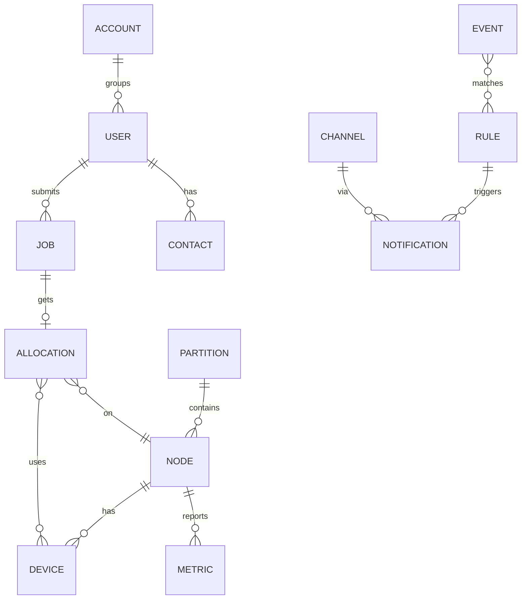

# 数据模型与 API

## 1. 实体关系



## 2. 表结构草案

> 仅核心字段，省略时间戳/审计列。生产用 PostgreSQL，单机用 SQLite，经存储接口屏蔽差异。

```sql
-- 用户与归属
user(id, name, role, password_hash, created_at)
account(id, name, parent_id, fairshare_weight)          -- 后期：公平份额
contact(id, user_id, channel, address)                  -- email/feishu/... 地址
preference(user_id, preferred_channels, quiet_hours)

-- 拓扑与资源
node(id, name, partition_id, state, transport, addr, ssh_config, labels_json,
     cpus_total, mem_total, last_heartbeat)
device(id, node_id, kind, vendor, idx, uuid, mem_total)  -- kind: gpu|npu
partition(id, name, priority, max_walltime, allowed_users_json, limits_json)

-- 作业与分配
job(id, owner_id, partition_id, state, priority, script, env_json,
    req_cpus, req_mem, req_gpus, gpu_type, constraints_json, walltime,
    depends_on_json, mail_type, exit_code, submit_at, start_at, end_at)
allocation(id, job_id, node_id, cpus, mem, devices_json, started_at, ended_at)

-- 指标（近线；历史可下采样或转 Prometheus 远端写）
metric(node_id, ts, kind, payload_json)                 -- 也可走 TSDB

-- 事件与通知
event(id, type, severity, source, labels_json, dedup_key, summary, detail_json, ts)
rule(id, name, match_json, notify_json, throttle_json, enabled)
channel(id, name, kind, config_json)                    -- 通知器实例配置（凭据加密）
notification(id, event_id, rule_id, user_id, channel_id, status, attempts,
             last_error, delivered_at)
```

## 3. API 接口（gRPC，经 grpc-gateway 暴露 REST）

| 领域 | 方法（gRPC） | REST 等价 |
| --- | --- | --- |
| 作业 | `SubmitJob` / `ListJobs` / `GetJob` / `CancelJob` / `HoldJob` / `ReleaseJob` / `StreamLogs` | `POST/GET /v1/jobs`，`DELETE /v1/jobs/{id}` |
| 节点 | `ListNodes` / `GetNode` / `RegisterNode` / `DrainNode` / `ResumeNode` | `GET /v1/nodes`，`POST /v1/nodes/{id}:drain` |
| 分区 | `CreatePartition` / `ListPartitions` / `UpdatePartition` | `… /v1/partitions` |
| 指标 | `QueryMetrics`（当前/区间） | `GET /v1/metrics` + `/metrics`(Prometheus) |
| 事件 | `ListEvents` | `GET /v1/events` |
| 规则 | `CreateRule` / `ListRules` / `UpdateRule` | `… /v1/rules` |
| 通道 | `CreateChannel` / `ListChannels` / `TestChannel` | `… /v1/channels`，`:test` |
| 认证 | `Login` / `CreateToken` / `ListTokens` | `… /v1/auth` |

Agent↔Server 内部接口（不对外）：`RegisterAgent`、`ReportMetrics(stream)`、
`ReportJobStatus(stream)`、`StreamLogs(stream)`、`Dispatch(stream 命令下发)`、`Heartbeat`。

## 4. CLI 映射（对标 Slurm）

| skctl 命令 | Slurm 类比 | 作用 |
| --- | --- | --- |
| `skctl submit [-N nodes] [--gpus 2] [--mem 32G] [-t 24h] -- <cmd>` | `sbatch`/`srun` | 提交作业 |
| `skctl queue [--me] [--state running]` | `squeue` | 查看队列 |
| `skctl nodes` / `skctl info` | `sinfo` | 节点/分区状态与资源 |
| `skctl cancel <jobid>` | `scancel` | 取消作业 |
| `skctl logs -f <jobid>` | — | 跟踪作业日志 |
| `skctl node drain/resume <node>` | `scontrol update` | 节点维护 |
| `skctl notify test --channel feishu` | — | 通道连通性自检 |
| `skctl gpu` / `skctl npu` | — | 设备利用率/占用一览 |

提交示例：

```bash
skctl submit --partition gpu --gpus 2 --gpu-type A100 --mem 64G -t 12h \
  --mail-type END,FAIL --name train-bert \
  -- python train.py --config big.yaml
```

## 5. 配置文件草案

`server.yaml`：

```yaml
listen: { grpc: :7443, http: :8080 }
store: { driver: postgres, dsn: "postgres://..." }   # 或 sqlite: file:skipper.db
scheduler: { policy: priority, interval: 5s, backfill: false }
metrics: { retention: 7d, prometheus: true }
auth: { token_ttl: 720h }
```

`agent.yaml`：

```yaml
server: { addr: skipper:7443 }     # 直连；隧道模式下由 server 反向接入
node: { name: gpu-01, partition: gpu, labels: [nvlink] }
loopback: 127.0.0.1:7070           # 仅 SSH 场景只监听回环
collectors: { interval: 10s, gpu: nvidia, npu: ascend }
detect: { disk_threshold: 0.9, device_idle: { util: 0.05, duration: 30m } }
```
