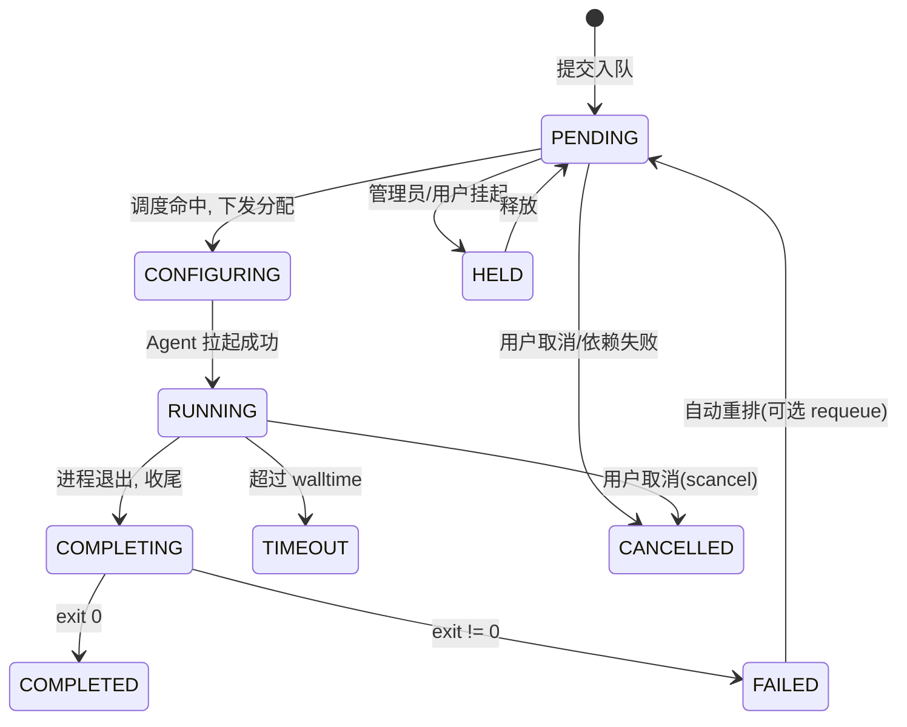

# 调度子系统

对标 Slurm 的核心抽象，但做了精简，保证初期可实现、后期可演进。

## 1. 核心概念

| 概念 | 对应 Slurm | 说明 |
| --- | --- | --- |
| Node | node | 一台计算资源载体，含 CPU/内存/设备清单、状态、标签 |
| Device | GRES(gpu) | GPU/NPU 等可计数/可分配设备，带类型与拓扑信息 |
| Partition | partition | 节点的逻辑分组 + 策略（优先级、限额、可用用户、最大时长） |
| Job | job | 一次资源请求 + 执行体（命令/脚本），调度的基本单位 |
| Allocation | allocation | 调度器把作业绑定到具体节点/设备的结果 |
| QOS | qos | 服务质量等级（优先级权重、抢占、限额），后期 |
| Account | account | 计费/公平份额归属，后期 |

### 1.1 资源请求模型

作业声明它**需要什么**，而非指定具体节点：

```yaml
resources:
  cpus: 8
  mem: 32Gi
  gpus: 2                 # 数量
  gpu_type: A100          # 可选：按设备型号约束
  constraints: [nvlink]   # 可选：节点特性标签匹配
walltime: 24h             # 最大运行时长（用于 Backfill 与超时）
partition: gpu
priority: 100             # 可选，默认由多因子计算
depends_on: [1234]        # 作业依赖（afterok 等）
```

## 2. 作业生命周期



- 状态流转由**作业管理器**驱动，每次变更落库并可触发事件（如进入终态 → 通知提交者）。
- `COMPLETING` 阶段用于清理：回收设备、收尾日志、释放 cgroup、上报最终退出码。
- 终态：`COMPLETED / FAILED / CANCELLED / TIMEOUT`。

## 3. 调度循环

调度器是一个周期性（事件 + 定时混合触发）的循环：

```
1. 刷新集群快照：节点状态、空闲资源、运行中分配
2. 取出 PENDING 队列，按优先级排序
3. 主调度遍历：对每个作业做资源匹配 → 命中则预占资源、生成 Allocation
4. Backfill 遍历（阶段二）：在不推迟最高优先级作业预定开始时间的前提下，
   让能「填空」的小作业提前运行
5. 下发 Allocation 到目标 Agent；失败则回滚预占
6. 处理超时/抢占/重排
```

### 3.1 优先级（多因子，渐进实现）

初期：`priority = 显式优先级 ?? (排队时长权重 + 队列基础权重)`（近似 FIFO + 老化）。

后期多因子：`age`（老化）、`fairshare`（历史用量越多优先级越低）、`jobsize`、
`partition`、`qos` 加权求和，权重可配置 —— 与 Slurm `priority/multifactor` 一致的思路。

### 3.2 资源匹配与装箱

- 过滤：分区匹配、特性标签满足、设备型号满足、节点 `UP` 且非 `DRAIN`。
- 选择：在候选节点上对设备做 **best-fit 装箱**，减少碎片（如优先填满已用节点，
  或反之优先分散以隔离故障域，策略可配）。
- 拓扑感知（后期）：NVLink/同 NUMA 优先，提升多卡作业带宽。

### 3.3 Backfill（阶段二）

依赖每个作业的 `walltime` 估计：为最高优先级但暂时排不上的作业**预留**未来时间窗，
同时允许更短的小作业在窗口前的空隙里先跑，提高利用率且不饿死大作业。

### 3.4 抢占与重排（后期）

- 抢占：高 QOS 作业可挂起/重排低 QOS 作业（`requeue` 或 `suspend`）。
- 自动重排：节点失联导致的 RUNNING 作业可按策略重新入队。

## 4. 资源隔离与下发（Agent 侧）

调度器只产出 Allocation；真正的隔离在 Agent 执行器完成：

| 资源 | 隔离手段 |
| --- | --- |
| CPU | cgroup v2 `cpu.max` / `cpuset.cpus` |
| 内存 | cgroup v2 `memory.max`（超限 OOM 或上报） |
| GPU | `CUDA_VISIBLE_DEVICES=<分配到的索引>` |
| NPU(昇腾) | `ASCEND_RT_VISIBLE_DEVICES=<索引>` |
| 强隔离(可选) | 以 `docker run --gpus '"device=..."'` 或挂载 NPU 设备的嵌套容器执行 |

> 实现进度：M2 已落地**设备可见性隔离**（env）、walltime 与日志/退出码；
> **cgroup v2 的 CPU/内存硬限额**作为 M5 硬化项（需 cgroup2 委派与权限，按环境启用）。

执行器职责：
1. 准备工作目录、环境变量、设备可见性；
2. 写入并执行作业脚本（前台进程组，便于整组信号控制）；
3. 流式捕获 stdout/stderr 到日志（可滚动、可经 API `logs -f` 拉取）；
4. 监控进程组，处理 `walltime` 超时（SIGTERM→SIGKILL 宽限）；
5. 上报退出码与资源用量（峰值内存、运行时长等，用于计费/公平份额）。

## 5. 节点状态机

```
UNKNOWN → UP（注册+心跳正常）
UP → DRAIN（管理员标记，不再接新作业，已有作业跑完）
DRAIN → UP（resume）
UP → DOWN（心跳超时/不可达）→ 触发「节点失联」事件，运行中作业按策略处理
```

## 6. 调度器接口（便于替换策略）

```go
type Scheduler interface {
    // 输入集群快照与待调度队列，产出分配决策（纯函数，便于测试与回放）
    Schedule(snapshot ClusterSnapshot, pending []Job) []Decision
}

type Decision struct {
    JobID    string
    NodeID   string
    Devices  []int        // 分配到的设备索引
    CPUs     int
    MemBytes uint64
}
```

把调度策略做成可替换接口：默认 `fifo+priority`，后续加 `backfill`、`fairshare`，
甚至允许实验性外部调度器，而作业管理与资源下发逻辑保持不变。

## 7. 与 Slurm 的差异（有意为之）

- 不实现完整的 PMIx/MPI 紧耦合多节点启动（初期单节点作业，多节点后期）。
- 配置更轻：YAML + API 动态管理分区/节点，而非静态 `slurm.conf` 重载。
- 原生集成监控与通知，作业结束/设备空置直接驱动通知，无需外部脚本拼装。
