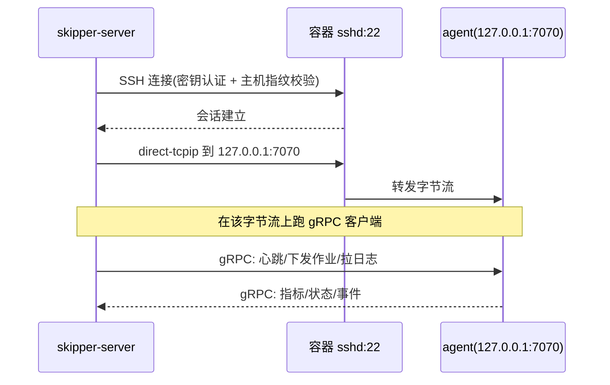

# 通信子系统（含 SSH 隧道）

控制平面与 Agent 之间的所有控制面 RPC 走 gRPC。难点在于：**部分 Docker 容器只放开
SSH(22) 端口**，控制平面无法直接连到 Agent 的 gRPC 端口。本文给出统一的传输抽象与
三种可选传输模式，并以 SSH 隧道为「仅 SSH」场景的默认方案。

## 1. 传输抽象

所有模式都把「与某节点 Agent 的连接」收敛成一个 `net.Conn`/`grpc.ClientConn`，
上层调度、上报、日志流逻辑对传输方式无感知。

```go
// 控制平面侧：给定节点配置，返回一个可用于 gRPC 的连接
type Transport interface {
    // 返回 grpc.DialOption 的 ContextDialer，gRPC 透明复用底层连接
    DialContext(ctx context.Context, node NodeConn) (net.Conn, error)
    Kind() string // "grpc" | "ssh-forward" | "reverse"
}
```

gRPC 通过 `grpc.WithContextDialer(transport.DialContext)` 接入，无论底层是 TCP、
SSH 转发出来的虚拟连接，还是反向隧道，上层一致。

## 2. 三种传输模式

### 2.1 直连 gRPC（mTLS）—— 网络允许时首选

```
skipper-server  ──TLS gRPC──►  skipper-agent:<port>
```

- Agent 监听端口对 Server 可达；双向 TLS 证书校验。
- 开销最低，适合同内网的物理机/虚拟机。

### 2.2 SSH 本地转发（控制平面发起）—— 「仅 SSH」场景默认 ✅

适配「Docker 只开放 22」：Agent **只监听 127.0.0.1**，Server 用 SSH 登入容器，
在 SSH 通道内把流量转发到 Agent 的回环 gRPC 端口。



Go 实现要点（`golang.org/x/crypto/ssh`）：

```go
sshConn, _ := ssh.Dial("tcp", "container-host:22", sshConfig) // 密钥认证
dialer := func(ctx context.Context, _ string) (net.Conn, error) {
    return sshConn.Dial("tcp", "127.0.0.1:7070")              // 隧道内连回环
}
grpcConn, _ := grpc.DialContext(ctx, "passthrough:///agent",
    grpc.WithContextDialer(dialer), grpc.WithTransportCredentials(insecure.NewCredentials()))
```

- 只要容器暴露 22，且 Server 有登录凭据，即可纳管，**无需容器额外开端口**。
- 隧道内可再加轻量 Token（gRPC metadata）做应用层校验。
- 一条 SSH 连接可多路复用多个 `direct-tcpip` 通道（gRPC 多流），无需多次握手。

### 2.3 反向隧道（Agent 发起）—— 仅允许出站时

当节点既不开放入站端口、连 22 也不暴露，但**允许出站**时，由 Agent 主动连 Server。

两种实现：

- **反向 gRPC 流**（推荐）：Agent 拨号到 Server，建立一条长连接的双向 stream，
  Server 把「下发作业/拉日志」当作命令推到这条 stream，Agent 执行后回结果。
  无需在 Server 上额外跑 sshd。
- **SSH 远程转发（`ssh -R`）**：Agent 用 SSH 连到 Server 主机并远程转发一个端口回来，
  Server 经该端口直连 Agent。适合已有 SSH 跳板的环境。

### 2.4 实现现状（M3 已落地）

由于本实现的 **Agent 是 gRPC 客户端**（主动连 server），M3 落地的是「**控制平面发起 SSH
+ 反向端口转发**」：控制平面 SSH 进容器（SSH 端口**任意，不限 22**），请求 sshd 在容器回环
上监听一个端口并经 SSH 通道转发回控制平面 gRPC；容器内 Agent 只需 `--server` 指向该回环端口。
等价于 `ssh -R`，容器除 SSH 外无需开放/出站任何端口。已实现主机公钥校验、断线重连与保活。

```yaml
# server 配置片段
ssh_nodes:
  - name: gpu-docker-07
    addr: "gpu-host-07:2207"          # 容器 sshd 可达地址(端口任意)
    user: root
    key: "/etc/skipper/keys/node07"
    known_host: "ssh-ed25519 AAAA..." # 主机公钥(ssh-keyscan -p 2207 host)
    remote_listen: "127.0.0.1:7600"   # Agent 用 --server 127.0.0.1:7600 连接
```

> Agent 自举（推送二进制 + 远程启动）当前为手动步骤（`scp -P <port>` + 运行），自动化列为后续项。

## 3. 模式选择与配置

每个节点在注册时声明其传输方式：

```yaml
nodes:
  - name: gpu-phys-01
    transport: grpc            # 直连
    addr: 10.0.0.11:7070
    tls: { ca: ..., cert: ..., key: ... }

  - name: gpu-docker-07         # 仅开放 SSH 的容器
    transport: ssh-forward
    ssh:
      addr: gpu-host-07:2207     # 反代/映射到容器 sshd 的端口
      user: root
      key: /etc/skipper/keys/node07
      known_host: "ssh-ed25519 AAAA..."   # 主机指纹，防中间人
    agent_loopback: 127.0.0.1:7070

  - name: edge-npu-03           # 只能出站
    transport: reverse          # Agent 主动回连，见 2.3
```

选择决策树：

```
能从 Server 直连 Agent 端口?  ──是──► grpc(mTLS)
        │否
仅开放 SSH(22) 且 Server 有登录凭据?  ──是──► ssh-forward
        │否
允许 Agent 出站?  ──是──► reverse(反向 gRPC 流)
        │否
        └──► 不可纳管（需至少一种可达路径）
```

## 4. Agent 引导（SSH-only 容器）

对「只有 SSH」的容器，可做到**近似无 Agent 的自举**，类似 Ansible：

```
1. Server 经 SSH/SFTP 把对应架构的 skipper-agent 二进制推送到容器
2. 经 SSH 启动：nohup skipper-agent --loopback 127.0.0.1:7070 --token ... &
   （有 systemd 则注册为服务；无则用进程管理/重启守护）
3. Server 通过 2.2 的 SSH 本地转发与之建立 gRPC，完成注册
4. 后续控制面流量全部走该隧道
```

二进制随发布提供 amd64/arm64（arm64 便于昇腾环境），Server 按节点架构选择推送。

## 5. 连接管理与可靠性

- **保活与重连**：隧道/连接断开后指数退避重连；Agent 本地环形缓冲在断连期间暂存
  指标与状态，重连后补传，避免数据空洞。
- **心跳**：Server 周期 ping；连续丢失判定节点 `DOWN` → 触发「节点失联」事件，
  运行中作业按调度策略处理（重排/标记失败）。
- **多路复用**：单条 SSH/gRPC 连接上承载心跳、指标流、日志流、命令下发等多路逻辑通道。
- **背压**：日志/指标流采用带缓冲与丢弃策略，避免单节点拖垮 Server。

## 6. 安全

| 模式 | 认证 | 加密 | 防中间人 |
| --- | --- | --- | --- |
| grpc | mTLS 双向证书 | TLS | CA 校验 |
| ssh-forward | SSH 密钥认证 | SSH | `known_host` 主机指纹校验 |
| reverse | Server 端 Token + TLS | TLS | CA 校验 |

- SSH 私钥、Token 等通过密钥后端/加密配置注入，不入库明文。
- 隧道内 gRPC 仍校验应用层 Token，做到「传输 + 应用」双层认证。
- 主机指纹必须校验（`known_host`），杜绝首次连接被劫持。

## 7. 为什么不直接用现成方案？

- **纯 SSH `-L/-R` 脚本**：能跑，但缺连接管理、重连、健康、引导自动化，难以规模化。
- **WireGuard/Tailscale 等 overlay**：很好，但要求节点能装内核模块/额外守护，
  与「容器仅开放 SSH、不可改造」的约束冲突。可作为**可选增强**，不作为默认依赖。
- Skipper 的做法是把 SSH 隧道**内建并自动化**，对「不可改造、只有 SSH」的环境零额外要求。
